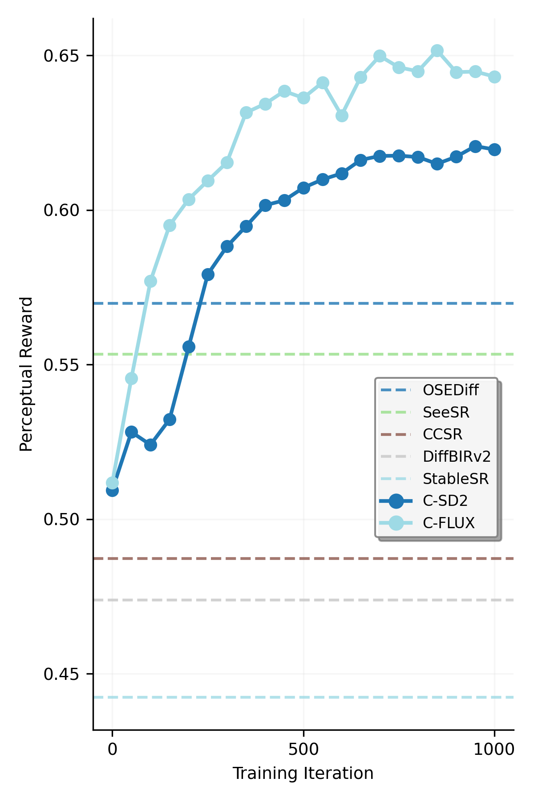

<div align="center">

<h1>DP²O-SR: Direct Perceptual Preference Optimization for Real-World Image Super-Resolution (NeurIPS 2025)</h1>

<div>
  <a href="https://scholar.google.com/citations?hl=en&user=A-U8zE8AAAAJ" target="_blank">Rongyuan Wu<sup>1,2</sup></a>&emsp;
  <a href="https://scholar.google.com/citations?user=ZCDjTn8AAAAJ&hl=en" target="_blank">Lingchen Sun<sup>1,2</sup></a>&emsp;
  <a href="https://scholar.google.com/citations?user=UX26wSMAAAAJ&hl=en" target="_blank">Zhengqiang Zhang<sup>1,2</sup></a>&emsp;
  <a href="https://scholar.google.com/citations?hl=en&user=7TWugs4AAAAJ" target="_blank">Shihao Wang<sup>1</sup></a><br>  
  <a href="https://scholar.google.com/citations?hl=en&user=QW1JtysAAAAJ" target="_blank">Tianhe Wu<sup>2,3</sup></a>&emsp;
  <a href="https://scholar.google.com/citations?user=y5bqy0AAAAAJ&hl=zh-CN" target="_blank">Qiaosi Yi<sup>1,2</sup></a>&emsp;
  <a href="https://scholar.google.com/citations?hl=en&user=Bd73ldQAAAAJ" target="_blank">Shuai Li<sup>1</sup></a>&emsp;
  <a href="https://www4.comp.polyu.edu.hk/~cslzhang/" target="_blank">Lei Zhang<sup>1,2,†</sup></a>
</div>

<div style="margin-top: 4px;">
  <sup>1</sup>The Hong Kong Polytechnic University &emsp;
  <sup>2</sup>OPPO Research Institute &emsp;
  <sup>3</sup>City University of Hong Kong
</div>

<div style="margin-top: 6px;">
  <sup>†</sup>Corresponding author
</div>

[📄 Paper ](https://arxiv.org/pdf/2406.08177)


</div>


## 🧠 What This Work Does

**DP²O-SR** is a training framework that aligns generative real-world super-resolution models with perceptual preferences — without requiring human annotations.

We leverage the **stochasticity** of generative models (diffusion/flow-based) to sample diverse outputs, and optimize them using a **hybrid perceptual reward** built from IQA models trained on large-scale human preference data.

<details>
<summary>📷 Click to show framework</summary>


</details>

### 🚀 Fast Convergence with Strong Gains  
Even with only **500 training iterations**, DP²O-SR brings significant improvements in perceptual quality — outperforming strong baselines like [SeeSR](https://github.com/cswry/SeeSR) and [OSEDiff](https://github.com/cswry/OSEDiff).

<details>
<summary>📷 Click to show training curves</summary>



</details>

## 🌟 Key Contributions

### ✅ Balanced Perceptual Reward  
Combines full-reference (fidelity) and no-reference (realism) IQA metrics to guide training with a **hybrid reward**.

<details>
<summary>📷 Click to show illustration</summary>


</details>


### 🔄 Multiple Preference Pairs Learning 
Instead of one best-vs-worst pair, we rank multiple outputs per input and sample multiple preference pairs — leading to richer and more stable learning.


### 📊 Data Curation Strategy  
The optimal sampling strategy depends on model capacity:  
- Small models prefer **broader coverage** (e.g. 1/4)  
- Large models learn better with **stronger contrast** (e.g. 1/16)

<details>
<summary>📷 Click to show illustration</summary>


</details>


### 🧩 Hierarchical Preference Optimization (HPO)  
We adaptively weight each preference pair:  
- **Intra-group**: favor larger reward gaps  
- **Inter-group**: prioritize diverse candidate groups


## 🔍 Interesting Observations


### 📊 DP²O-SR Improves Output Consistency Across Random Seeds  
We explore how perceptual quality varies with the number of sampled outputs **M** per input, where M increases exponentially from 1 to 64 (i.e., M = 2ⁿ).  

**Key findings:**

- **Best@M** increases with M — higher perceptual peaks observed
- **Worst@M** drops in baselines, but improves significantly with DP²O-SR  
- **Mean@M** stays relatively stable — but still benefits slightly from our approach

This shows that **DP²O-SR not only improves average perceptual quality** but more importantly **raises the quality floor**, resulting in more consistent and robust outputs across different seeds.

<details>
<summary>📷 Click to show reward statistics</summary>


</details>


### ✨ Local Refinement from Global Reward  
DP²O-SR leads to **localized visual improvements**, even though training is guided by **global IQA rewards** only.

- **Seed sensitivity remains**: Even within the same model, different random seeds cause variations in local structures (e.g., wing textures, insect eyes).  
- **Same-seed refinement**: Under the same seed, DP²O-SR outputs consistently show sharper and more accurate textures than the baseline (e.g., clearer wing venation).  
- **Global-to-local effect**: These refinements emerge without any explicit local supervision, suggesting the model learns to enhance perceptually salient regions.

<details>
<summary>📷 Click to show example</summary>


</details>

## 🧰 TODO: Code & Model Release

We will release:

- 🧵 Training code (diffusion + flow-based)
- 📁 Training data & IQA labels
- 🧪 Testing code & evaluation scripts
- 💾 Checkpoints:
  - Pre-trained: `C-SD2`, `C-FLUX`
  - Post-trained: `DP²O-SR(SD2)`, `DP²O-SR(FLUX)`

<!-- ## 📜 Citation

```bibtex
@inproceedings{wu2025dp2osr,
  title     = {DP²O-SR: Direct Perceptual Preference Optimization for Real-World Image Super-Resolution},
  author    = {Wu, Rongyuan and Sun, Lingchen and Zhang, Zhengqiang and Wang, Shihao and Wu, Tianhe and Yi, Qiaosi and Li, Shuai and Zhang, Lei},
  booktitle = {NeurIPS},
  year      = {2025}
}
``` -->