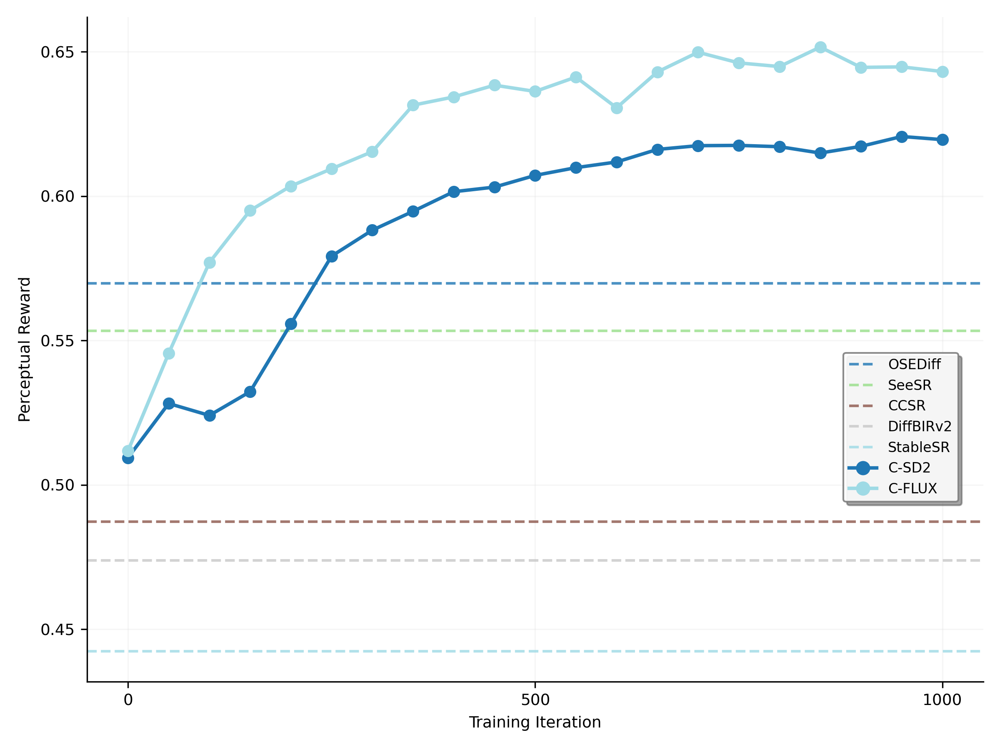

<div align="center">

<h1>DP²O-SR: Direct Perceptual Preference Optimization for Real-World Image Super-Resolution (NeurIPS 2025)</h1>

<div>
  <a href="https://scholar.google.com/citations?hl=en&user=A-U8zE8AAAAJ" target="_blank">Rongyuan Wu<sup>1,2</sup></a>&emsp;
  <a href="https://scholar.google.com/citations?user=ZCDjTn8AAAAJ&hl=en" target="_blank">Lingchen Sun<sup>1,2</sup></a>&emsp;
  <a href="https://scholar.google.com/citations?user=UX26wSMAAAAJ&hl=en" target="_blank">Zhengqiang Zhang<sup>1,2</sup></a>&emsp;
  <a href="https://scholar.google.com/citations?hl=en&user=7TWugs4AAAAJ" target="_blank">Shihao Wang<sup>1</sup></a><br>  
  <a href="https://scholar.google.com/citations?hl=en&user=QW1JtysAAAAJ" target="_blank">Tianhe Wu<sup>2,3</sup></a>&emsp;
  <a href="https://scholar.google.com/citations?user=y5bqy0AAAAAJ&hl=zh-CN" target="_blank">Qiaosi Yi<sup>1,2</sup></a>&emsp;
  <a href="https://scholar.google.com/citations?hl=en&user=Bd73ldQAAAAJ" target="_blank">Shuai Li<sup>1</sup></a>&emsp;
  <a href="https://www4.comp.polyu.edu.hk/~cslzhang/" target="_blank">Lei Zhang<sup>1,2,†</sup></a>
</div>

<div style="margin-top: 4px;">
  <sup>1</sup>The Hong Kong Polytechnic University &emsp;
  <sup>2</sup>OPPO Research Institute &emsp;
  <sup>3</sup>City University of Hong Kong
</div>

<div style="margin-top: 6px;">
  <sup>†</sup>Corresponding author
</div>

[📄 Paper ](https://arxiv.org/pdf/2510.18851)


</div>


## 📋 Todo List

We will release:

- ~~[ ] Testing code~~
- ~~[ ] Pretrained checkpoints:~~
  - `C-SD2`, `C-FLUX`
- ~~[ ] DP²O-SR fine-tuned models:~~
  - `DP²O-SR(SD2)`, `DP²O-SR(FLUX)`
- [ ] Training code (diffusion-based & flow-based)
- [ ] Training datasets & IQA reward labels


## 🧠 TL;DR
 
DP²O-SR post-trains generative SR models to better match human perceptual preferences,  
by optimizing over diverse outputs (sampled via noise) using IQA-based rewards, without requiring human annotations during training.


<p align="center">
  
</p>


### 🚀 Fast Convergence with Strong Gains
**DP²O-SR achieves strong perceptual gains in just 500 training steps**, outperforming powerful baselines like [SeeSR](https://github.com/cswry/SeeSR) and [OSEDiff](https://github.com/cswry/OSEDiff).

<p align="center">
  
</p>


## 🌟 Key Contributions

### Balanced Perceptual Reward

<details>
<summary>Visual comparison: different reward types</summary>

Combines full-reference (fidelity) and no-reference (realism) IQA metrics to guide training with a **hybrid reward**.


</details>


### Multiple Preference Pairs Learning

<details>
<summary>Specific details</summary>
Unlike the conventional best-vs-worst strategy, we rank the generated outputs for each input and retain only the top-N and bottom-N samples to form positive and negative sets. Preference pairs are then constructed between these subsets, avoiding uncertain middle samples and leading to richer supervision and more stable training.


</details>


###  Data Curation Strategy

<details>
<summary>Sampling strategy trend</summary>

The optimal sampling strategy depends on model capacity:  
- Small models prefer **broader coverage** (e.g. 1/4)  
- Large models learn better with **stronger contrast** (e.g. 1/16)

<p align="center">
  
  
</p>

<p align="center"><b>Figure:</b> Sampling strategy trend on C-SD2 (left) and C-FLUX (right).</p>

</details>


### Hierarchical Preference Optimization (HPO)

<details>
<summary>Adaptive intra/inter-group weighting</summary>

We adaptively weight each preference pair:  
- **Intra-group**: favor larger reward gaps  
- **Inter-group**: prioritize diverse candidate groups

</details>


## 🔍 Interesting Observations

### DP²O-SR Improves Output Consistency Across Random Seeds

<details>
<summary>Best@M / Mean@M / Worst@M curves</summary>

We explore how perceptual quality varies with the number of sampled outputs **M** per input, where M increases exponentially from 1 to 64 (i.e., M = 2ⁿ).  

**Key findings:**

- **Best@M** increases with M — higher perceptual peaks observed  
- **Worst@M** drops in baselines, but improves significantly with DP²O-SR  
- **Mean@M** stays relatively stable — but still benefits slightly from our approach  

This shows that **DP²O-SR not only improves average perceptual quality** but more importantly **raises the quality floor**, resulting in more consistent and robust outputs across different seeds.


<p align="center">
  
  
</p>

<p align="center"><b>Figure:</b> Perceptual reward curves across varying sample numbers (M). Left: C-SD2; Right: C-FLUX.</p>

</details>
<!-- </details> -->


### Local Refinement under Global Reward

<details>
<summary>Examples of local detail enhancement</summary>

DP²O-SR leads to **localized visual improvements**, even though training is guided by **global IQA rewards** only.

- **Seed sensitivity remains**: Even within the same model, different random seeds cause variations in local structures (e.g., wing textures, insect eyes).  
- **Same-seed refinement**: Under the same seed, DP²O-SR outputs consistently show sharper and more accurate textures than the baseline (e.g., clearer wing venation).  
- **Global-to-local effect**: These refinements emerge without any explicit local supervision, suggesting the model learns to enhance perceptually salient regions.

<p align="center">
  
</p>

<p align="center"><b>Figure:</b> DP²O-SR enhances local details (e.g., wing structure, red box) while preserving stable regions (e.g., head reflections, green box).</p>

</details>

## ⚙️ Dependencies and Installation
```
## git clone this repository
git clone https://github.com/cswry/DP2O-SR.git
cd DP2O-SR

# create an environment with python >= 3.8
conda create -n dp2osr python=3.8
conda activate dp2osr
pip install -r requirements.txt
```

## 🚀 Quick Inference
#### Step 1: Download the pretrained models
- Download the pretrained **FLUX.1-dev** from [Google Drive](https://drive.google.com/drive/folders/1LVSwWbjJdn5Wxy79AwV5LdPX2S2Hotx1?usp=sharing).
- Since the official **SD2-base** has been taken down, we have hosted it together with **C-FLUX**, **DP²O-FLUX**, **C-SD2**, and **DP²O-SD2** on [Google Drive](https://drive.google.com/drive/folders/1LVSwWbjJdn5Wxy79AwV5LdPX2S2Hotx1?usp=sharing).
- Additionally, the **RAM** and **DAPE** models (used for extracting tag-style text prompts) are also available on [Google Drive](https://drive.google.com/drive/folders/1LVSwWbjJdn5Wxy79AwV5LdPX2S2Hotx1?usp=sharing).

You can put the models into `preset/models`.


#### Step 2: Prepare testing data
You can put the testing images in the `preset/test_inp`.

#### Step 3: Running testing command
```
# C-SD2
accelerate launch test_sd2b_controlnet.py \
    --pretrained_model_name_or_path "preset/models/stable-diffusion-2-base" \
    --controlnet_model_name_or_path "preset/models/c-sd2/model.safetensors" \
    --image_path "preset/test_inp" \
    --output_dir "preset/test_oup_c_sd2" \
    --align_method "adain" \
    --ram_path "preset/models/ram_swin_large_14m.pth" \
    --dape_path "preset/models/DAPE.pth" \
    --guidance_scale 3.5 \
    --num_inference_steps 50 \
    --mixed_precision "fp16" 
    
# DP²O-SD2
accelerate launch test_sd2b_controlnet.py \
    --pretrained_model_name_or_path "preset/models/stable-diffusion-2-base" \
    --controlnet_model_name_or_path "preset/models/dp2o-sd2/model.safetensors" \
    --image_path "preset/test_inp" \
    --output_dir "preset/test_oup_dp2o_sd2" \
    --align_method "adain" \
    --ram_path "preset/models/ram_swin_large_14m.pth" \
    --dape_path "preset/models/DAPE.pth" \
    --guidance_scale 3.5 \
    --num_inference_steps 50 \
    --mixed_precision "fp16" 

# C-FLUX
accelerate launch test_flux_controlnet.py \
    --pretrained_model_name_or_path "black-forest-labs/FLUX.1-dev" \
    --controlnet_model_name_or_path "preset/models/c-flux/model.safetensors" \
    --image_path "preset/test_inp" \
    --output_dir "preset/test_oup_c_flux" \
    --align_method "adain" \
    --ram_path "preset/models/ram_swin_large_14m.pth" \
    --dape_path "preset/models/DAPE.pth" \
    --num_double_layers 4 \
    --num_single_layers 0 \
    --guidance_scale 2.5 \
    --num_inference_steps 25 \
    --mixed_precision "fp16" 
    
# DP²O-FLUX
accelerate launch test_flux_controlnet.py \
    --pretrained_model_name_or_path "black-forest-labs/FLUX.1-dev" \
    --controlnet_model_name_or_path "preset/models/dp2o-flux/model.safetensors" \
    --image_path "preset/test_inp" \
    --output_dir "preset/test_oup_dp2o_flux" \
    --align_method "adain" \
    --ram_path "preset/models/ram_swin_large_14m.pth" \
    --dape_path "preset/models/DAPE.pth" \
    --num_double_layers 4 \
    --num_single_layers 0 \
    --guidance_scale 2.5 \
    --num_inference_steps 25 \
    --mixed_precision "fp16" 
```

## 📜 Citation

```bibtex
@inproceedings{wu2025dp2osr,
  title     = {DP²O-SR: Direct Perceptual Preference Optimization for Real-World Image Super-Resolution},
  author    = {Wu, Rongyuan and Sun, Lingchen and Zhang, Zhengqiang and Wang, Shihao and Wu, Tianhe and Yi, Qiaosi and Li, Shuai and Zhang, Lei},
  journal={arXiv preprint arXiv:2510.18851},
  year      = {2025}
}
```
